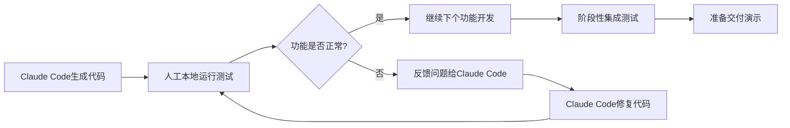

# GBase AI监控系统 - 第一阶段开发计划 (Claude Code版)

## 📋 计划概述

**阶段目标**: 构建可用的MVP系统，实现核心质量监控功能  
**开发周期**: 4周 (28天)  
**主要工具**: Claude Code + 人工配合  
**交付成果**: 基础监控系统 + 核心质量指标展示

---

## 🎯 第一阶段 MVP 功能范围

### ✅ **包含功能 (Claude Code可实现)**
1. **基础前端框架** - React + TypeScript项目搭建
2. **核心UI组件** - 登录、导航、仪表盘基础布局  
3. **模拟数据接口** - Mock API实现核心质量指标展示
4. **基础图表展示** - ECharts集成，显示解决率趋势
5. **简单状态管理** - Zustand状态管理集成
6. **基础样式系统** - Tailwind CSS + Ant Design集成

### ❌ **暂不包含 (需要人工或后期实现)**
1. **真实数据库集成** - PostgreSQL连接和配置
2. **GBase API集成** - 需要真实API密钥和权限
3. **用户认证系统** - JWT认证和权限管理
4. **实时WebSocket** - 需要服务器部署和配置
5. **生产环境部署** - Kubernetes集群和云服务配置

---

## 🚀 Claude Code 开发能力分析

### ✅ **Claude Code 擅长的任务**

| 开发任务类型 | 适用程度 | 具体能力 |
|-------------|----------|----------|
| **前端代码编写** | 🟢 **优秀** | • React组件开发<br/>• TypeScript类型定义<br/>• CSS样式编写<br/>• 组件库集成 |
| **配置文件生成** | 🟢 **优秀** | • package.json<br/>• tsconfig.json<br/>• vite.config.ts<br/>• tailwind.config.js |
| **Mock数据创建** | 🟢 **优秀** | • 模拟API响应<br/>• 测试数据生成<br/>• JSON Schema定义 |
| **代码架构设计** | 🟢 **优秀** | • 目录结构规划<br/>• 组件设计模式<br/>• 类型安全设计 |
| **文档编写** | 🟢 **优秀** | • 技术文档<br/>• API文档<br/>• 使用说明 |

### ⚠️ **Claude Code 限制范围**

| 限制类型 | 具体限制 | 影响程度 |
|----------|----------|----------|
| **实时服务运行** | ❌ 无法启动开发服务器<br/>❌ 无法运行npm/yarn命令 | 🔴 高 |
| **网络请求** | ❌ 无法访问外部API<br/>❌ 无法验证真实接口 | 🔴 高 |
| **数据库操作** | ❌ 无法连接数据库<br/>❌ 无法执行SQL | 🟡 中 |
| **文件系统限制** | ❌ 无法访问系统服务<br/>❌ 无法修改权限 | 🟡 中 |
| **第三方服务** | ❌ 无法部署到云平台<br/>❌ 无法配置域名 | 🟡 中 |

---

## 📅 详细开发时间规划

### **Week 1: 项目基础搭建 (7天)**

#### **Day 1-2: 项目初始化**
**✅ Claude Code 可完成:**
```typescript
// 任务清单
□ 创建React + TypeScript项目结构
□ 配置Vite构建工具
□ 集成Tailwind CSS和Ant Design
□ 设置代码规范 (ESLint + Prettier)
□ 创建基础目录结构
```

**📁 预期输出文件:**
- `package.json` - 项目依赖配置
- `tsconfig.json` - TypeScript配置  
- `vite.config.ts` - 构建工具配置
- `tailwind.config.js` - 样式配置
- `/src` - 源码目录结构

#### **Day 3-4: 核心组件开发**
**✅ Claude Code 可完成:**
```typescript
// 组件开发任务
□ 创建Layout布局组件
□ 实现Header导航组件  
□ 开发Sidebar侧边栏
□ 构建基础页面路由
□ 实现登录页面UI (无功能)
```

**📁 预期输出文件:**
- `/src/components/Layout/` - 布局组件
- `/src/components/Header/` - 头部组件
- `/src/components/Sidebar/` - 侧边栏组件
- `/src/pages/Login/` - 登录页面
- `/src/router/` - 路由配置

#### **Day 5-7: 状态管理和工具集成**
**✅ Claude Code 可完成:**
```typescript
// 状态管理任务
□ 集成Zustand状态管理
□ 配置React Query数据获取
□ 创建API接口类型定义
□ 实现主题切换功能
□ 添加国际化支持基础
```

**📁 预期输出文件:**
- `/src/store/` - 状态管理
- `/src/types/` - TypeScript类型定义
- `/src/api/` - API接口定义
- `/src/hooks/` - 自定义Hooks
- `/src/utils/` - 工具函数

---

### **Week 2: 核心功能实现 (7天)**

#### **Day 8-10: 仪表盘页面开发**
**✅ Claude Code 可完成:**
```typescript
// 仪表盘开发任务
□ 创建Dashboard主页布局
□ 实现KPI指标卡片组件
□ 集成ECharts图表库
□ 开发Session解决率展示组件
□ 创建负反馈率监控卡片
```

**📁 预期输出文件:**
- `/src/pages/Dashboard/` - 仪表盘页面
- `/src/components/MetricCard/` - 指标卡片
- `/src/components/Charts/` - 图表组件
- `/src/components/QualityMetrics/` - 质量指标组件

**🎨 预期界面效果:**
- 4x2网格布局的指标卡片
- Session解决率实时趋势图
- 负反馈率环形进度图
- 人工转接率柱状图

#### **Day 11-12: Mock数据和API集成**
**✅ Claude Code 可完成:**
```typescript
// 数据模拟任务
□ 创建质量指标Mock数据
□ 实现模拟API接口
□ 开发数据获取Hooks
□ 创建Loading和Error状态处理
□ 实现数据刷新机制
```

**📁 预期输出文件:**
- `/src/mock/` - 模拟数据
- `/src/api/mockApi.ts` - Mock API接口
- `/src/hooks/useQualityMetrics.ts` - 数据获取Hook
- `/src/components/Loading/` - 加载状态组件

**📊 Mock数据示例:**
```json
{
  "resolutionRate": {
    "current": 87.3,
    "target": 90.0,
    "trend": [85.1, 86.2, 87.3],
    "change": "+2.1%"
  },
  "negativeFeedbackRate": {
    "current": 4.2,
    "target": 5.0,
    "trend": [4.8, 4.5, 4.2],
    "change": "-12.5%"
  }
}
```

#### **Day 13-14: 交互功能完善**
**✅ Claude Code 可完成:**
```typescript
// 交互功能任务
□ 实现时间范围选择器
□ 添加数据筛选功能
□ 开发图表交互响应
□ 实现响应式布局适配
□ 添加页面切换动画
```

**📁 预期输出文件:**
- `/src/components/TimeRangePicker/` - 时间选择器
- `/src/components/FilterPanel/` - 筛选面板
- `/src/styles/animations.css` - 动画样式
- `/src/hooks/useResponsive.ts` - 响应式Hook

---

### **Week 3: 功能扩展和优化 (7天)**

#### **Day 15-17: 质量分析页面**
**✅ Claude Code 可完成:**
```typescript
// 质量分析页面任务
□ 创建QualityAnalysis页面布局
□ 实现多维度质量指标对比
□ 开发趋势分析图表组件
□ 添加质量得分计算显示
□ 实现异常检测提示组件
```

**📁 预期输出文件:**
- `/src/pages/QualityAnalysis/` - 质量分析页面
- `/src/components/TrendChart/` - 趋势图表
- `/src/components/ScoreGauge/` - 评分仪表盘
- `/src/components/AlertBadge/` - 异常提示

#### **Day 18-19: 用户行为页面**
**✅ Claude Code 可完成:**
```typescript
// 用户行为页面任务  
□ 创建UserBehavior页面框架
□ 实现用户活跃度展示
□ 开发用户分群可视化
□ 添加企业域名分析展示
□ 创建行为路径展示组件
```

**📁 预期输出文件:**
- `/src/pages/UserBehavior/` - 用户行为页面
- `/src/components/UserSegments/` - 用户分群
- `/src/components/DomainAnalysis/` - 域名分析
- `/src/components/UserJourney/` - 用户路径

#### **Day 20-21: 报表和导出功能**
**✅ Claude Code 可完成:**
```typescript
// 报表功能任务
□ 创建Reports页面布局
□ 实现报表模板展示
□ 开发数据导出组件 (前端实现)
□ 添加打印友好样式
□ 创建报表配置面板
```

**📁 预期输出文件:**
- `/src/pages/Reports/` - 报表页面
- `/src/components/ReportTemplate/` - 报表模板
- `/src/components/ExportButton/` - 导出按钮
- `/src/styles/print.css` - 打印样式

---

### **Week 4: 集成测试和优化 (7天)**

#### **Day 22-24: 界面优化和测试**
**✅ Claude Code 可完成:**
```typescript
// 优化和测试任务
□ 完善所有页面的响应式布局
□ 优化图表加载性能
□ 添加错误边界处理
□ 实现组件单元测试
□ 优化代码分割和懒加载
```

**📁 预期输出文件:**
- `/src/tests/` - 测试文件
- `/src/components/ErrorBoundary/` - 错误边界
- `/src/utils/performance.ts` - 性能优化工具
- `vite.config.ts` - 构建优化配置

#### **Day 25-26: 文档编写**
**✅ Claude Code 可完成:**
```typescript
// 文档编写任务
□ 编写项目README文档
□ 创建组件使用文档
□ 编写部署指南
□ 创建开发者指南
□ 生成API文档
```

**📁 预期输出文件:**
- `README.md` - 项目说明
- `/docs/DEPLOYMENT.md` - 部署指南
- `/docs/DEVELOPMENT.md` - 开发指南
- `/docs/API.md` - API文档

#### **Day 27-28: 最终集成和交付**
**✅ Claude Code 可完成:**
```typescript
// 最终集成任务
□ 整合所有功能模块
□ 修复发现的Bug
□ 优化整体用户体验
□ 准备演示数据
□ 创建部署包
```

**📦 最终交付物:**
- 完整的前端源码包
- 构建后的静态文件
- 部署和使用文档
- 演示用Mock数据

---

## ❌ Claude Code 无法完成的任务清单

### **🔴 高优先级 - 需要人工完成**

#### **1. 开发环境运行和调试**
**限制说明**: Claude Code无法执行npm命令或启动开发服务器
**替代方案**:
```bash
# 人工需要执行的命令
npm install                    # 安装依赖
npm run dev                   # 启动开发服务器
npm run build                 # 构建生产版本
npm run test                  # 运行测试
```

**解决建议**: 
- 使用本地开发环境配合Claude Code生成的代码
- 定期手动运行测试和构建验证代码正确性

#### **2. 真实API集成**
**限制说明**: 无法访问GBase真实API或验证接口连通性
**影响范围**:
```typescript
// 无法验证的接口
const api = {
  getQualityMetrics: 'GET /v1/quality/resolution-rate',
  getUserAnalytics: 'GET /v1/users/activity-stats', 
  getConversations: 'GET /v1/{ai_id}/session.messages'
};
```

**替代方案**:
- 第一阶段使用Mock数据完整实现界面
- 预留API接口结构，后期人工集成真实数据
- 提供详细的API集成指南文档

#### **3. 用户认证系统**
**限制说明**: 无法实现真实的JWT认证和会话管理
**需要人工实现**:
```typescript
// 需要人工开发的认证功能
interface AuthSystem {
  login(credentials: LoginCredentials): Promise<AuthResult>;
  logout(): void;
  refreshToken(): Promise<string>;
  checkPermissions(action: string): boolean;
}
```

**临时方案**: 实现登录界面，使用localStorage模拟登录状态

### **🟡 中等优先级 - 后期需要完善**

#### **4. 实时数据推送**
**限制说明**: 无法实现WebSocket连接和实时更新
**影响功能**: 
- 质量指标实时更新
- 告警实时通知
- 系统状态监控

**替代方案**: 使用定时轮询模拟实时更新效果

#### **5. 生产环境配置**  
**限制说明**: 无法配置生产环境和部署流程
**需要人工处理**:
- Docker容器配置
- Kubernetes部署文件
- CI/CD流水线设置
- 域名和SSL证书配置

#### **6. 性能监控集成**
**限制说明**: 无法集成Prometheus等监控工具
**需要后期添加**:
- 前端性能埋点
- 错误追踪系统
- 用户行为分析

---

## 🔧 开发环境准备要求

### **人工需要准备的环境**
```bash
# Node.js环境要求
node: >=18.0.0
npm: >=9.0.0 或 pnpm: >=8.0.0

# 开发工具推荐
IDE: VS Code
插件: 
  - ES7+ React/Redux/React-Native snippets
  - TypeScript Hero  
  - Tailwind CSS IntelliSense
  - Auto Rename Tag

# 浏览器要求
Chrome/Edge: 最新版本 (支持ES2020+)
Firefox: 最新版本
```

### **Claude Code生成的配置文件**
```json
{
  "name": "gbase-monitor",
  "version": "0.1.0",
  "type": "module",
  "dependencies": {
    "react": "^18.2.0",
    "react-dom": "^18.2.0",
    "typescript": "^5.0.0",
    "antd": "^5.12.0",
    "echarts": "^5.4.0",
    "echarts-for-react": "^3.0.2",
    "zustand": "^4.4.0",
    "@tanstack/react-query": "^5.0.0",
    "react-router-dom": "^6.18.0",
    "dayjs": "^1.11.0",
    "lodash-es": "^4.17.21"
  },
  "devDependencies": {
    "@types/react": "^18.2.0",
    "@types/react-dom": "^18.2.0",
    "@vitejs/plugin-react": "^4.0.0",
    "vite": "^5.0.0",
    "tailwindcss": "^3.3.0",
    "autoprefixer": "^10.4.0",
    "postcss": "^8.4.0",
    "eslint": "^8.55.0",
    "prettier": "^3.1.0"
  }
}
```

---

## 📊 第一阶段预期成果

### **✅ 可演示的功能**
1. **完整的前端界面** - 所有主要页面和组件
2. **模拟数据展示** - 核心质量指标的可视化
3. **交互功能** - 时间筛选、数据切换、图表交互
4. **响应式设计** - 支持桌面和移动端访问
5. **主题切换** - 明暗主题支持

### **📊 具体指标展示**
```typescript
// 实现的核心指标
interface MVPMetrics {
  resolutionRate: {
    current: number;      // 87.3%
    trend: number[];      // 7天趋势
    target: number;       // 90%目标值
  };
  
  negativeFeedbackRate: {
    current: number;      // 4.2%
    reasons: string[];    // 反馈原因分类
    timeline: object[];   // 时间线数据
  };
  
  escalationRate: {
    current: number;      // 12.8%
    triggers: string[];   // 转接触发原因
    distribution: object[]; // 时间分布
  };
  
  aiQualityScore: {
    overall: number;      // 92.1分
    components: object[]; // 各维度得分
    comparison: object;   // 同期对比
  };
}
```

### **🎨 界面预览效果**
- **Dashboard**: 4x2指标卡片 + 3个主要趋势图
- **质量分析**: 多维度对比图表 + 异常检测提示
- **用户行为**: 用户分群饼图 + 活跃度热力图  
- **报表**: 模板选择 + 数据导出(CSV/PDF)

---

## 🚨 风险控制和应急预案

### **主要开发风险**
| 风险类型 | 风险描述 | 概率 | 影响 | 应对措施 |
|----------|----------|------|------|----------|
| **代码兼容性** | 生成的代码存在版本兼容问题 | 中 | 中 | 人工测试验证，及时调整 |
| **Mock数据不准确** | 模拟数据与真实业务不匹配 | 高 | 低 | 与业务团队确认数据格式 |
| **组件集成问题** | 第三方组件集成失败 | 低 | 高 | 提供多种技术方案选择 |
| **性能优化不足** | 前端性能达不到要求 | 中 | 中 | 代码分割和懒加载优化 |

### **质量保证措施**
```typescript
// 代码质量检查清单
const QualityChecklist = {
  codeStandards: [
    '✅ TypeScript类型覆盖率 > 90%',
    '✅ ESLint无错误警告',
    '✅ Prettier代码格式统一',
    '✅ 组件Props类型完整定义'
  ],
  
  functionality: [
    '✅ 所有页面可正常访问',
    '✅ 数据加载和错误状态处理',
    '✅ 响应式布局在各设备正常',
    '✅ 图表交互功能完整'
  ],
  
  performance: [
    '✅ 首页加载时间 < 3秒',
    '✅ 图表渲染流畅无卡顿',
    '✅ 内存使用合理无泄漏',
    '✅ 打包体积优化合理'
  ]
};
```

---

## 📋 开发任务分工建议

### **Claude Code 负责任务 (80%)**
- ✅ 所有前端代码编写和架构设计
- ✅ 配置文件和工具链设置
- ✅ Mock数据和API接口定义
- ✅ 组件开发和样式实现
- ✅ 文档编写和技术说明

### **人工协作任务 (20%)**
- 🔧 **环境搭建**: 安装Node.js，配置开发环境
- 🔧 **代码运行**: 执行npm命令，启动开发服务器
- 🔧 **功能测试**: 在浏览器中测试各项功能
- 🔧 **Bug修复**: 根据测试结果修复Claude Code代码
- 🔧 **部署准备**: 构建生产版本，准备部署包

### **协作工作流程**


---

## 🎯 第一阶段成功标准

### **技术指标**
- ✅ **代码质量**: TypeScript覆盖率>90%，无ESLint错误
- ✅ **界面完整度**: 4个主要页面，20+核心组件
- ✅ **功能完整度**: 核心质量指标展示功能100%实现
- ✅ **响应速度**: 页面加载时间<3秒，图表渲染<1秒
- ✅ **兼容性**: 支持Chrome/Firefox/Edge最新版本

### **业务指标**  
- ✅ **用户体验**: 界面直观易用，符合监控系统设计规范
- ✅ **数据展示**: 核心质量指标清晰展示，趋势一目了然
- ✅ **交互体验**: 筛选切换流畅，图表交互响应及时
- ✅ **可演示性**: 能够向业务方完整演示系统核心功能

### **交付物清单**
- 📦 **源码包**: 完整的前端项目代码
- 📦 **构建包**: 可直接部署的静态文件
- 📦 **文档包**: 部署指南、开发文档、API说明
- 📦 **演示包**: 包含丰富Mock数据的演示版本

---

**总结**: 第一阶段通过Claude Code可以实现80%的前端开发工作，剩余20%需要人工配合完成环境配置、测试运行和集成工作。这种协作模式可以大幅提升开发效率，快速交付可演示的MVP系统。