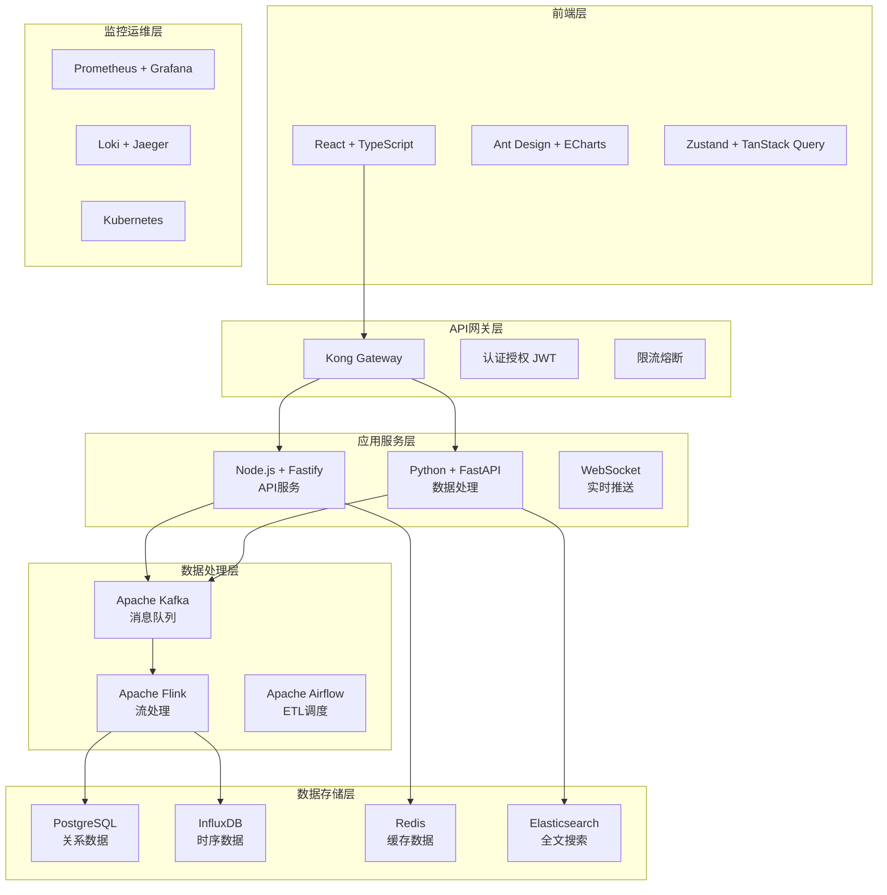
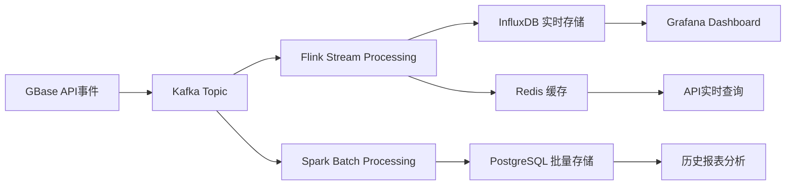
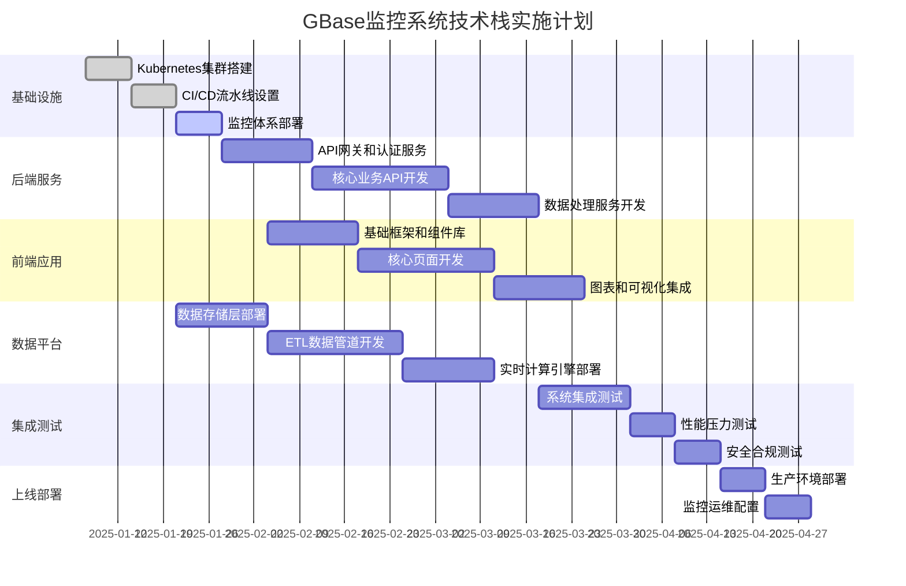

# GBase AI监控系统 - 技术栈推荐方案

## 🎯 **推荐理由和架构概述**

基于GBase AI监控系统的具体需求分析，推荐采用**现代化云原生技术栈**，重点考虑：
- **实时性**: 支持5秒内指标更新的流处理架构
- **高可用**: 99.9%可用性的分布式容错设计
- **可扩展**: 支持海量数据和高并发的弹性架构  
- **开发效率**: 成熟生态和丰富工具链
- **运维友好**: 云原生部署和监控体系

---

## 🏗️ **系统架构图**



---

## 🎨 **前端技术栈详解**

### **🎯 核心选型：React 18 + TypeScript**

| 技术组件 | 版本 | 选择理由 | 替代方案 |
|----------|------|----------|----------|
| **React** | 18.2+ | • 生态最完善<br/>• Concurrent模式支持实时更新<br/>• Hooks优雅的状态管理 | Vue 3, Angular |
| **TypeScript** | 5.0+ | • 企业级代码质量保障<br/>• 优秀的IDE支持<br/>• 减少运行时错误 | JavaScript |
| **构建工具** | Vite 5+ | • 极快的开发启动<br/>• HMR热更新<br/>• 现代化ES模块 | Webpack, Parcel |

### **🎨 UI组件和样式方案**

```typescript
// 技术栈配置示例
{
  // UI组件库 - 企业级设计语言
  "antd": "^5.12.0",              // 丰富组件、国际化支持
  
  // 图表可视化 - 强大的数据展示
  "echarts": "^5.4.0",            // 功能完善、性能优秀
  "echarts-for-react": "^3.0.2",  // React集成
  
  // 状态管理 - 现代化方案
  "zustand": "^4.4.0",            // 轻量、易用的状态管理
  "@tanstack/react-query": "^5.0.0", // 服务端状态管理
  
  // 样式方案 - 实用优先
  "tailwindcss": "^3.3.0",        // 实用CSS框架
  "@emotion/react": "^11.11.0",   // CSS-in-JS方案
  
  // 路由和导航
  "react-router-dom": "^6.18.0",  // 标准路由方案
  
  // 工具库
  "dayjs": "^1.11.0",             // 轻量日期处理
  "lodash-es": "^4.17.21",        // 实用工具函数
}
```

### **📊 数据可视化重点配置**

```typescript
// ECharts配置示例 - 适配监控场景
const chartConfig = {
  // 实时数据更新
  animation: false,
  
  // 大数据量优化
  progressive: 1000,
  progressiveThreshold: 3000,
  
  // 响应式设计
  grid: { containLabel: true },
  
  // 暗色主题支持
  darkMode: 'auto',
  
  // 国际化配置
  locale: 'ja', // 日本市场支持
};

// 关键图表类型
- 实时折线图: Session解决率趋势
- 热力图: 用户活跃度分布  
- 桑基图: 用户行为路径分析
- 仪表盘: 综合质量得分
- 散点图: AI模型性能相关性
```

---

## ⚙️ **后端技术栈详解**

### **🎯 核心架构：微服务 + 事件驱动**

#### **主要服务划分**
```yaml
api-gateway:          # Kong Gateway - API统一入口
  - 认证授权
  - 限流熔断  
  - 路由转发

user-service:         # Node.js + Fastify - 用户管理
  - 用户认证
  - 权限管理
  - 会话管理

metrics-service:      # Python + FastAPI - 指标计算  
  - 质量指标计算
  - 实时数据处理
  - 统计分析算法

notification-service: # Node.js + Fastify - 通知告警
  - WebSocket实时推送  
  - 告警规则引擎
  - 邮件/短信通知

report-service:       # Python + FastAPI - 报表生成
  - 报表模板引擎
  - 数据导出
  - 定时任务调度
```

#### **技术选型详解**

| 服务类型 | 技术栈 | 选择理由 | 适用场景 |
|----------|--------|----------|----------|
| **API服务** | Node.js + Fastify | • 高性能HTTP服务<br/>• 原生WebSocket支持<br/>• TypeScript完整支持 | 实时API、用户管理 |
| **数据处理** | Python + FastAPI | • 丰富科学计算库<br/>• AI/ML算法支持<br/>• 异步高并发 | 指标计算、报表生成 |
| **消息处理** | Node.js + Bull | • Redis队列支持<br/>• 任务调度和重试<br/>• 可视化监控面板 | 异步任务、批量处理 |

#### **核心依赖配置**

```json
// Node.js 服务包配置
{
  "fastify": "^4.24.0",           // 高性能Web框架
  "fastify/websocket": "^8.3.0",  // WebSocket支持
  "@fastify/cors": "^8.4.0",      // 跨域处理
  "@fastify/jwt": "^7.2.0",       // JWT认证
  "@fastify/rate-limit": "^8.0.0", // 限流保护
  
  "prisma": "^5.6.0",             // 数据库ORM
  "ioredis": "^5.3.0",            // Redis客户端
  "bull": "^4.11.0",              // 任务队列
  
  "winston": "^3.11.0",           // 日志管理
  "joi": "^17.11.0",              // 参数验证
  "dayjs": "^1.11.0",             // 日期处理
}
```

```python
# Python 服务依赖
fastapi==0.104.0          # 现代Web框架
uvicorn==0.24.0           # ASGI服务器  
pydantic==2.5.0          # 数据验证
sqlalchemy==2.0.0        # ORM框架
asyncpg==0.29.0          # PostgreSQL异步客户端
redis==5.0.0             # Redis客户端

pandas==2.1.0            # 数据分析
numpy==1.24.0            # 数值计算  
scikit-learn==1.3.0      # 机器学习
matplotlib==3.7.0        # 图表生成

celery==5.3.0            # 分布式任务队列
prometheus-client==0.19.0 # 监控指标
structlog==23.2.0        # 结构化日志
```

---

## 💾 **数据存储架构详解**

### **🎯 分层存储策略**

#### **数据分类和存储选型**

| 数据类型 | 存储技术 | 数据特点 | 保留策略 | 访问模式 |
|----------|----------|----------|----------|----------|
| **元数据** | PostgreSQL 15 | 结构化、关系复杂 | 永久保留 | 频繁读写、ACID事务 |
| **时序指标** | InfluxDB 2.7 | 时间序列、大批量 | 1年后归档 | 高频写入、聚合查询 |
| **缓存数据** | Redis 7.2 | 高频访问、临时性 | TTL自动过期 | 毫秒级读写 |
| **全文搜索** | Elasticsearch 8 | 非结构化文本 | 6个月 | 复杂搜索查询 |
| **消息队列** | Kafka 3.6 | 事件流、顺序性 | 7天 | 顺序消费、批处理 |
| **对象存储** | MinIO | 大文件、静态资源 | 永久 | 一次写入、多次读取 |

#### **数据模型设计示例**

```sql
-- PostgreSQL 核心表结构
CREATE TABLE users (
    id SERIAL PRIMARY KEY,
    email VARCHAR(255) UNIQUE NOT NULL,
    company_domain VARCHAR(100),
    created_at TIMESTAMP DEFAULT NOW(),
    updated_at TIMESTAMP DEFAULT NOW()
);

CREATE TABLE ai_conversations (
    id UUID PRIMARY KEY DEFAULT gen_random_uuid(),
    user_id INTEGER REFERENCES users(id),
    ai_id VARCHAR(50) NOT NULL,
    session_id VARCHAR(100) NOT NULL,
    status VARCHAR(20) DEFAULT 'active',
    resolution_status VARCHAR(20),
    quality_score DECIMAL(3,2),
    created_at TIMESTAMP DEFAULT NOW(),
    updated_at TIMESTAMP DEFAULT NOW()
);

-- 分区表设计（按时间分区）
CREATE TABLE conversation_messages (
    id UUID PRIMARY KEY,
    conversation_id UUID REFERENCES ai_conversations(id),
    role VARCHAR(20) NOT NULL, -- 'user' | 'assistant'
    content TEXT NOT NULL,
    response_time_ms INTEGER,
    created_at TIMESTAMP DEFAULT NOW()
) PARTITION BY RANGE (created_at);

-- 创建月度分区
CREATE TABLE conversation_messages_2025_01 
PARTITION OF conversation_messages
FOR VALUES FROM ('2025-01-01') TO ('2025-02-01');
```

```javascript
// InfluxDB 时序数据结构
const timeSeriesData = {
  measurement: 'quality_metrics',
  tags: {
    ai_id: 'gbase-chat-v2.1',
    region: 'jp-east',
    metric_type: 'resolution_rate'
  },
  fields: {
    value: 87.3,
    target: 90.0,
    samples: 1250
  },
  timestamp: Date.now()
};

// Redis 缓存结构  
const cacheKeys = {
  'metrics:resolution_rate:1h': 'sorted_set', // 1小时内的实时数据
  'session:user_123': 'hash',                 // 用户会话信息
  'alert:rules:active': 'list',               // 活跃告警规则
  'dashboard:config:user_456': 'json'         // 用户仪表盘配置
};
```

### **🔄 数据处理流程**

#### **实时数据流 (Lambda架构)**



#### **数据处理组件配置**

```yaml
# Apache Flink 流处理配置
flink_job:
  parallelism: 4
  checkpoint_interval: 5000ms  # 5秒检查点
  restart_strategy: fixed-delay
  
  source:
    - kafka_conversations      # 对话事件流
    - kafka_user_actions      # 用户行为流
    - kafka_system_metrics    # 系统指标流
  
  processors:
    - resolution_rate_calculator    # 解决率实时计算
    - negative_feedback_detector    # 负反馈检测
    - user_activity_aggregator      # 用户活跃度聚合
  
  sinks:
    - influxdb_metrics_sink        # 指标存储
    - redis_cache_sink             # 实时缓存  
    - elasticsearch_search_sink    # 搜索索引

# Apache Airflow DAG 配置
airflow_dags:
  daily_report_generation:
    schedule: "0 8 * * *"          # 每日8点执行
    tasks:
      - extract_conversation_data   # 提取对话数据
      - calculate_quality_metrics  # 计算质量指标
      - generate_user_insights     # 生成用户洞察
      - send_management_report     # 发送管理报表
  
  weekly_data_cleanup:
    schedule: "0 2 * * 0"          # 每周日2点执行  
    tasks:
      - archive_old_conversations  # 归档旧对话
      - compress_logs              # 压缩日志文件
      - update_search_indexes      # 更新搜索索引
```

---

## 📊 **监控运维技术栈**

### **🎯 云原生监控方案**

#### **监控体系架构**

```yaml
# Prometheus 监控配置
monitoring_stack:
  metrics_collection:
    prometheus: 
      version: "2.47.0"
      retention: "30d"
      scrape_interval: "15s"
      
    node_exporter: "1.6.1"        # 系统指标
    postgres_exporter: "0.13.2"   # 数据库指标  
    redis_exporter: "1.55.0"      # Redis指标
    kafka_exporter: "1.6.0"       # Kafka指标
  
  visualization:
    grafana:
      version: "10.2.0"
      dashboards:
        - gbase_quality_metrics    # 质量指标仪表盘
        - system_performance       # 系统性能监控
        - user_behavior_analysis   # 用户行为分析
        - api_gateway_metrics      # API网关监控
  
  alerting:
    alertmanager:
      version: "0.26.0"
      integrations:
        - email: "alerts@gbase.ai"
        - slack: "#gbase-alerts"
        - webhook: "https://api.gbase.ai/webhooks/alerts"

# 日志聚合配置  
logging_stack:
  collection:
    promtail: "2.9.0"             # 日志收集代理
    fluent-bit: "2.2.0"           # 轻量级日志处理器
    
  storage:
    loki: "2.9.0"                 # 日志存储引擎
    retention: "90d"
    
  analysis:
    grafana: "10.2.0"             # 日志查询界面
    elastalert: "0.2.4"           # 日志告警规则

# 分布式追踪
tracing_stack:
  jaeger:
    version: "1.51.0"
    sampling_rate: 0.1            # 10%采样率
    retention: "7d"
    
  instrumentation:
    opentelemetry_js: "^1.17.0"   # Node.js追踪
    opentelemetry_python: "1.21.0" # Python追踪
```

#### **关键监控指标定义**

```yaml
# 业务监控指标
business_metrics:
  quality_indicators:
    - resolution_rate             # Session解决率
    - negative_feedback_rate      # 负反馈率  
    - escalation_rate            # 人工转接率
    - ai_response_accuracy       # AI回复准确率
    
  user_metrics:
    - daily_active_users         # 日活用户
    - conversation_volume        # 对话量
    - user_retention_rate        # 用户留存率
    - enterprise_adoption        # 企业用户采用率

# 系统监控指标
system_metrics:  
  performance:
    - api_response_time          # API响应时间
    - database_connection_pool   # 数据库连接池
    - cache_hit_ratio           # 缓存命中率
    - message_queue_lag         # 消息队列延迟
    
  availability:
    - service_uptime            # 服务可用时间
    - error_rate_by_endpoint    # 端点错误率
    - cpu_memory_utilization    # 资源使用率
    - disk_io_metrics          # 磁盘IO指标

# 告警规则示例
alert_rules:
  critical:
    - resolution_rate < 80%      # 解决率过低
    - api_error_rate > 5%        # API错误率过高
    - database_down             # 数据库宕机
    - disk_usage > 90%          # 磁盘空间不足
    
  warning:  
    - resolution_rate < 85%      # 解决率下降
    - response_time > 1s        # 响应时间过长
    - memory_usage > 80%        # 内存使用过高
    - queue_messages > 10000    # 消息队列堆积
```

---

## 🚀 **部署架构和DevOps**

### **🎯 Kubernetes云原生部署**

#### **集群架构设计**

```yaml
# Kubernetes集群配置
kubernetes_cluster:
  version: "1.28"
  nodes:
    master_nodes: 3              # 高可用控制平面
    worker_nodes: 6              # 工作节点（可弹性扩展）
    node_specs:
      cpu: "8 cores"
      memory: "32GB"  
      disk: "200GB SSD"
      
  networking:
    cni: "Calico"                # 网络插件
    service_mesh: "Istio"        # 服务网格（可选）
    ingress: "NGINX Ingress"     # 入口控制器

# 应用部署配置
application_deployment:
  namespaces:
    - gbase-monitor-prod         # 生产环境
    - gbase-monitor-staging      # 测试环境  
    - gbase-monitor-dev          # 开发环境
    
  deployments:
    frontend:
      replicas: 3
      resources:
        requests: { cpu: "200m", memory: "256Mi" }
        limits: { cpu: "500m", memory: "512Mi" }
        
    api_service:  
      replicas: 4
      resources:
        requests: { cpu: "500m", memory: "1Gi" }
        limits: { cpu: "1", memory: "2Gi" }
        
    metrics_service:
      replicas: 2  
      resources:
        requests: { cpu: "1", memory: "2Gi" }
        limits: { cpu: "2", memory: "4Gi" }

# 自动扩缩容配置        
autoscaling:
  horizontal_pod_autoscaler:
    api_service:
      min_replicas: 2
      max_replicas: 10
      cpu_threshold: 70%
      memory_threshold: 80%
      
  vertical_pod_autoscaler:
    enabled: true
    update_mode: "Auto"
```

#### **CI/CD流水线设计**

```yaml
# GitLab CI配置示例
stages:
  - test
  - build  
  - deploy
  - monitor

# 前端构建流水线
frontend_pipeline:
  test:
    script:
      - npm install
      - npm run test:coverage
      - npm run lint
      - npm run type-check
    coverage: '/Lines\s*:\s*(\d+\.\d+)%/'
    
  build:
    script:
      - npm run build
      - docker build -t $CI_REGISTRY_IMAGE/frontend:$CI_COMMIT_SHA .
      - docker push $CI_REGISTRY_IMAGE/frontend:$CI_COMMIT_SHA
      
  deploy:
    script:
      - argocd app sync gbase-monitor-frontend
      - kubectl rollout status deployment/frontend

# 后端构建流水线  
backend_pipeline:
  test:
    script:
      - pip install -r requirements-dev.txt
      - pytest --cov=app tests/
      - black --check app/
      - mypy app/
      
  build:
    script:
      - docker build -t $CI_REGISTRY_IMAGE/api:$CI_COMMIT_SHA .
      - trivy image --exit-code 1 $CI_REGISTRY_IMAGE/api:$CI_COMMIT_SHA
      - docker push $CI_REGISTRY_IMAGE/api:$CI_COMMIT_SHA
      
  deploy:
    script:
      - argocd app sync gbase-monitor-api
      - kubectl rollout status deployment/api-service

# ArgoCD GitOps配置
gitops:
  repository: "https://gitlab.com/gbase/monitor-deploy"
  applications:
    - name: "gbase-monitor"
      project: "default"
      source:
        repoURL: "https://gitlab.com/gbase/monitor-deploy"
        path: "manifests/production"
        targetRevision: "main"
      destination:
        server: "https://kubernetes.default.svc"
        namespace: "gbase-monitor-prod"
      syncPolicy:
        automated:
          prune: true
          selfHeal: true
```

---

## 🔐 **安全和合规设计**

### **🎯 多层安全防护**

#### **应用安全配置**

```yaml
# 认证授权配置
security_config:
  authentication:
    jwt:
      algorithm: "RS256"          # RSA公钥签名
      expiration: "1h"            # 1小时过期
      refresh_expiration: "7d"    # 刷新令牌7天
      
    oauth2:
      providers:
        - google                  # Google SSO
        - microsoft              # Microsoft AD
        - github                 # GitHub企业版
        
  authorization:
    rbac:                        # 基于角色的访问控制
      roles:
        - admin: ["*"]           # 管理员全权限
        - manager: ["read:*", "write:reports"] # 经理读权限+报表
        - analyst: ["read:metrics", "read:users"] # 分析师只读
        
  data_protection:
    encryption:
      at_rest: "AES-256"         # 静态数据加密
      in_transit: "TLS 1.3"      # 传输加密
      
    pii_handling:                # 个人信息保护
      anonymization: true        # 数据匿名化
      retention_policy: "2y"     # 2年保留期
      right_to_deletion: true    # 删除权利支持

# 网络安全配置
network_security:
  waf:                          # Web应用防火墙
    provider: "Cloudflare"
    rules:
      - ddos_protection         # DDoS防护
      - sql_injection_filter    # SQL注入防护
      - xss_protection         # XSS防护
      
  api_security:
    rate_limiting:
      global: "1000/min"        # 全局限流
      per_user: "100/min"       # 单用户限流
      per_ip: "300/min"         # 单IP限流
      
    cors_policy:
      allowed_origins: 
        - "https://monitor.gbase.ai"
        - "https://admin.gbase.ai"
      allowed_methods: ["GET", "POST", "PUT", "DELETE"]
      allowed_headers: ["Authorization", "Content-Type"]

# 合规要求（日本市场）
compliance:
  data_residency:
    location: "Japan (ap-northeast-1)"  # 数据驻留日本
    backup_location: "ap-northeast-3"   # 备份区域
    
  privacy_regulations:
    gdpr_compliance: true        # GDPR合规
    appi_compliance: true        # 日本个人信息保护法
    
  audit_logging:
    enabled: true
    retention: "7y"              # 7年审计日志保留
    events:
      - user_login               # 用户登录
      - data_access             # 数据访问  
      - configuration_changes    # 配置变更
      - admin_operations        # 管理员操作
```

---

## 💰 **成本优化和资源规划**

### **🎯 成本效益分析**

#### **基础设施成本估算**

| 资源类型 | 规格配置 | 月费用(USD) | 年费用(USD) | 备注 |
|----------|----------|-------------|-------------|------|
| **计算资源** | 6个节点(8C32G) | $1,800 | $21,600 | 可弹性扩缩容 |
| **存储资源** | 10TB SSD + 备份 | $600 | $7,200 | 分层存储优化 |
| **网络资源** | CDN + 负载均衡 | $300 | $3,600 | 全球加速优化 |
| **数据库服务** | RDS多可用区 | $800 | $9,600 | 高可用配置 |
| **监控运维** | 第三方服务 | $400 | $4,800 | SaaS监控平台 |
| **安全合规** | WAF + 审计 | $200 | $2,400 | 企业级安全 |
| **开发工具** | CI/CD + 代码托管 | $300 | $3,600 | 开发效率工具 |
| **总计** | - | **$4,400** | **$52,800** | 预估总成本 |

#### **成本优化策略**

```yaml
# 计算资源优化
compute_optimization:
  auto_scaling:
    scale_down_policy:
      - 非工作时间自动缩容50%    # 夜间和周末
      - 基于CPU使用率动态调整   # 40%-70%区间
      - 预留实例使用率 > 80%    # 长期稳定负载
      
  spot_instances:
    usage_scenarios:
      - 批量数据处理任务        # 非关键任务使用竞价实例  
      - 开发测试环境           # 60%成本节省
      - 机器学习模型训练       # 可中断任务
      
# 存储成本优化      
storage_optimization:
  tiered_storage:
    hot_data: "SSD (7天)"       # 频繁访问数据
    warm_data: "标准存储 (30天)" # 中等访问频率
    cold_data: "归档存储 (1年+)" # 长期归档数据
    
  data_lifecycle:
    compression: "gzip"         # 历史数据压缩
    deduplication: true         # 重复数据删除
    automatic_cleanup: true     # 自动清理过期数据

# 监控成本控制
cost_monitoring:
  budget_alerts:
    monthly_limit: "$5,000"     # 月度预算上限
    alert_thresholds: [80%, 90%, 100%] # 预算告警阈值
    
  resource_tagging:
    cost_center: "engineering"  # 成本中心标记
    project: "gbase-monitor"   # 项目标记  
    environment: ["prod", "staging", "dev"] # 环境标记
```

---

## 🎯 **最终推荐总结**

### **🏆 黄金技术栈组合**

```yaml
# 推荐的完整技术栈
recommended_stack:
  
  # 前端层 (现代化用户体验)
  frontend:
    framework: "React 18 + TypeScript"
    ui_library: "Ant Design 5.x"  
    charts: "Apache ECharts"
    state_management: "Zustand + TanStack Query"
    build_tool: "Vite"
    styling: "Tailwind CSS"
    
  # 后端层 (高性能微服务)  
  backend:
    api_service: "Node.js + Fastify"     # 实时API服务
    data_service: "Python + FastAPI"     # 数据处理服务  
    gateway: "Kong Gateway"              # API网关
    auth: "JWT + OAuth2"                 # 认证授权
    
  # 数据层 (分层存储架构)
  data:
    relational: "PostgreSQL 15"         # 关系数据
    timeseries: "InfluxDB 2.7"          # 时序数据
    cache: "Redis 7.2"                  # 缓存层
    search: "Elasticsearch 8"           # 全文搜索
    queue: "Apache Kafka 3.6"           # 消息队列
    storage: "MinIO"                     # 对象存储
    
  # 处理层 (实时 + 批处理)
  processing:
    stream: "Apache Flink 1.18"         # 实时流处理
    batch: "Apache Spark 3.5"           # 批量处理
    orchestration: "Apache Airflow 2.7" # 工作流调度
    
  # 运维层 (云原生监控)
  operations:
    container: "Docker + Kubernetes"     # 容器编排
    monitoring: "Prometheus + Grafana"   # 指标监控
    logging: "Loki + Grafana"           # 日志聚合
    tracing: "Jaeger"                   # 分布式追踪  
    ci_cd: "GitLab CI + ArgoCD"         # 持续部署
    
  # 安全层 (企业级防护)
  security:
    waf: "Cloudflare WAF"               # Web防火墙
    secrets: "HashiCorp Vault"          # 密钥管理
    compliance: "GDPR + APPI合规"       # 法规合规
    audit: "结构化审计日志"              # 操作审计
```

### **🚀 实施时间线**



### **🎖️ 核心优势总结**

| 优势维度 | 具体体现 | 预期收益 |
|----------|----------|----------|
| **开发效率** | • 现代化工具链和框架<br/>• 丰富的生态和组件<br/>• 自动化CI/CD流程 | 开发速度提升40% |
| **系统性能** | • 高并发架构设计<br/>• 分层缓存和存储<br/>• 实时流处理能力 | 响应时间<100ms |  
| **可扩展性** | • 微服务架构设计<br/>• 容器化云原生部署<br/>• 弹性扩缩容机制 | 支持10x业务增长 |
| **运维友好** | • 完善的监控告警<br/>• GitOps自动化运维<br/>• 丰富的可观测性 | 运维效率提升60% |
| **安全合规** | • 多层安全防护<br/>• 数据加密和脱敏<br/>• 法规合规支持 | 满足企业安全标准 |
| **成本控制** | • 开源技术栈为主<br/>• 智能资源调度<br/>• 成本监控优化 | 相比商业方案节省50% |

---

**最终建议**: 采用这套技术栈可以构建一个**现代化、高性能、易扩展**的AI监控系统，既满足当前业务需求，又具备未来发展的技术前瞻性。关键是要**分阶段实施**，优先搭建MVP验证核心功能，再逐步完善高级特性。